# 🏨 HỆ THỐNG QUẢN LÝ KHÁCH SẠN – SPRING BOOT
**Nhóm**: `00P_N05_T3_2025_GROUP_NAM_DUY_HUY`

Ứng dụng web quản lý khách sạn: quản lý khách hàng/phòng/dịch vụ, đặt phòng, gắn dịch vụ cho đơn, tạo & cập nhật hóa đơn, và các báo cáo doanh thu – công suất – dịch vụ bán chạy. Công nghệ **Spring Boot 3** + **Java 17**, giao diện **Thymeleaf/Bootstrap + Chart.js**, cơ sở dữ liệu **MySQL**.

---

## 🎯 Mục tiêu & Phạm vi
- Quản lý các thực thể cốt lõi: **Khách hàng**, **Phòng**, **Đặt phòng**, **Chi tiết dịch vụ**, **Hóa đơn**.
- Quy trình nghiệp vụ chính: **tìm phòng trống → đặt phòng → gắn dịch vụ → xuất & cập nhật hóa đơn → báo cáo**.
- Tổ chức theo **MVC**, có **Global Exception Handler**, test **`@WebMvcTest`** cho Controller.
- Giao diện Dashboard có **navbar** và bố cục **3 ô** (1 ô chính ở giữa, 2 ô bên dưới), biểu đồ bằng **Chart.js**.

---

## 🏗️ Kiến trúc & Công nghệ

**Kiến trúc tổng quan (MVC + Service orchestration)**
```
Controller (REST + View)  -->  Service (HotelCoreService, ...)
                                 | 
                                 v
                          Repository/JDBC (JdbcTemplate)
                                 |
                                 v
                              MySQL
```

**Thư mục chính**
```
HotelManagementSystem/complete/
  pom.xml
  src/
    main/java/com/example/servingwebcontent/
      ServingWebContentApplication.java            // main
      CoreFlowUIController.java                    // điều hướng UI -> coreflow.html
      config/GlobalExceptionHandler.java           // @RestControllerAdvice
      database/aivenConnection.java                // DataSource -> Connection (HikariCP)
      core/HotelCoreService.java                   // dịch vụ điều phối luồng nghiệp vụ
      controller/                                  // 8 controller REST (xem mục 5)
      model/                                       // 11 model + 5 enum (xem mục 4)
    main/resources/
      application.properties                       // cấu hình DB (lộ secret - lưu ý!)
      templates/coreflow.html                      // trang chính UI
      static/index.html                            // trang index mẫu
      certs/aiven-ca.pem                           // CA (hiện chưa thấy sử dụng)
    test/java/com/example/servingwebcontent/
      ...ControllerTest.java                       // 6 lớp @WebMvcTest
```
### Cấu hình /dev & IDE
- .devcontainer/devcontainer.json: cài OpenJDK 17 + Maven sau khi tạo container (Codespaces).
- .vscode/settings.json: cấu hình Java source path & build.
## 📐 UML & Activity Diagrams
> File gốc: `docs/diagrams/`

### UML Class Diagram
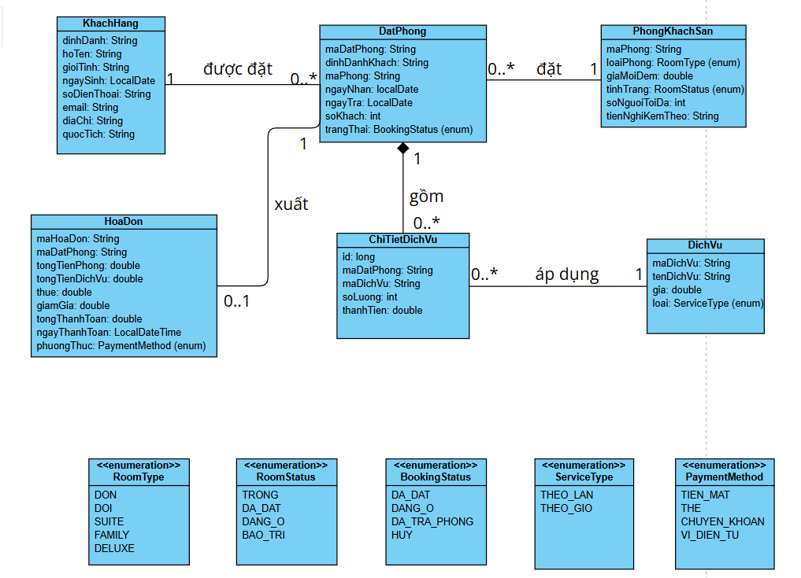

### Activity 1 — Tìm phòng
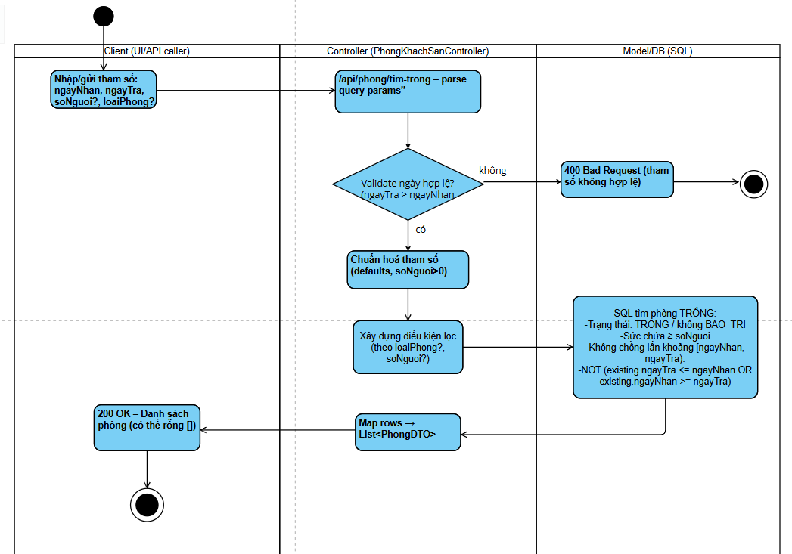

### Activity 2 — Đặt phòng
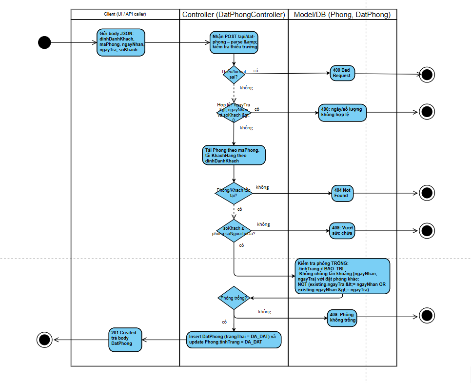

### Activity 3 — Check-in
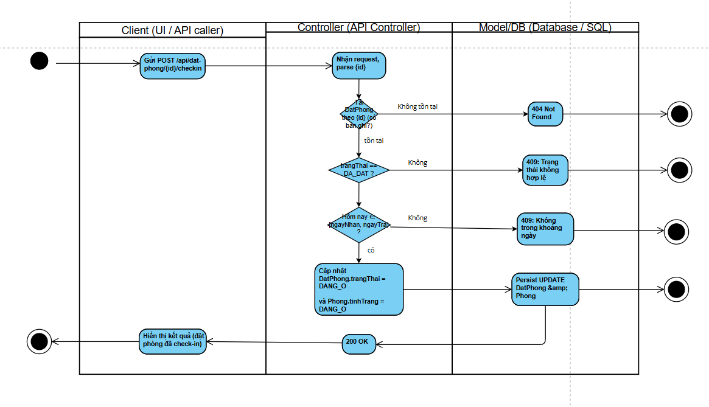

### Activity 4 — Thêm dịch vụ
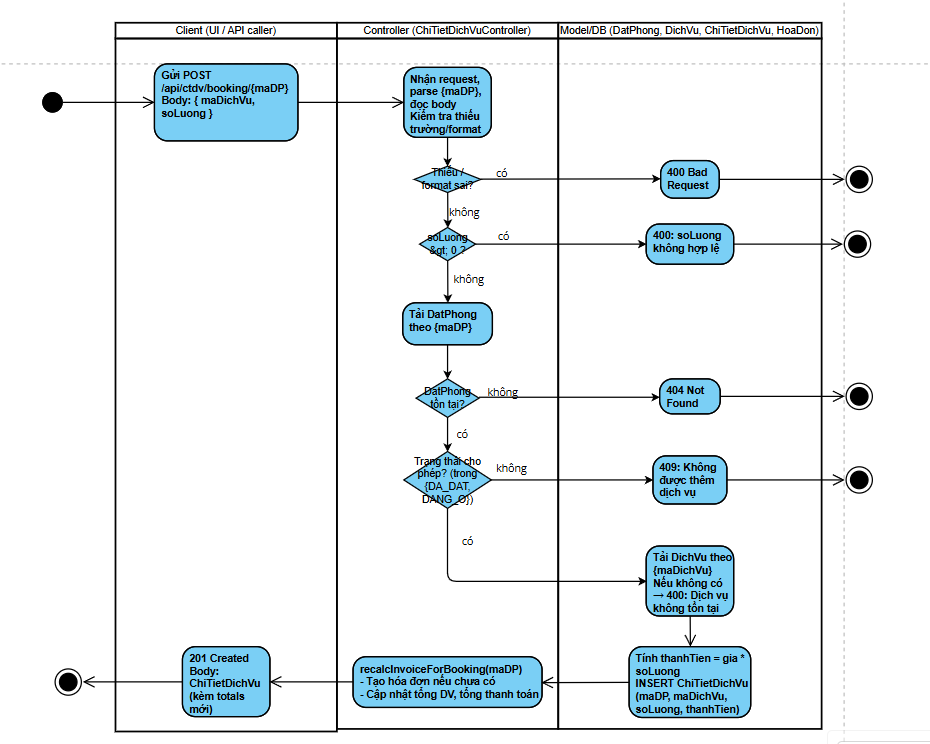

### Activity 5 — Xuất hóa đơn
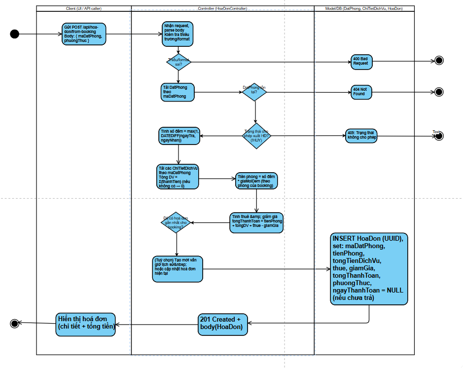

### Activity 6 — Pay & Clean
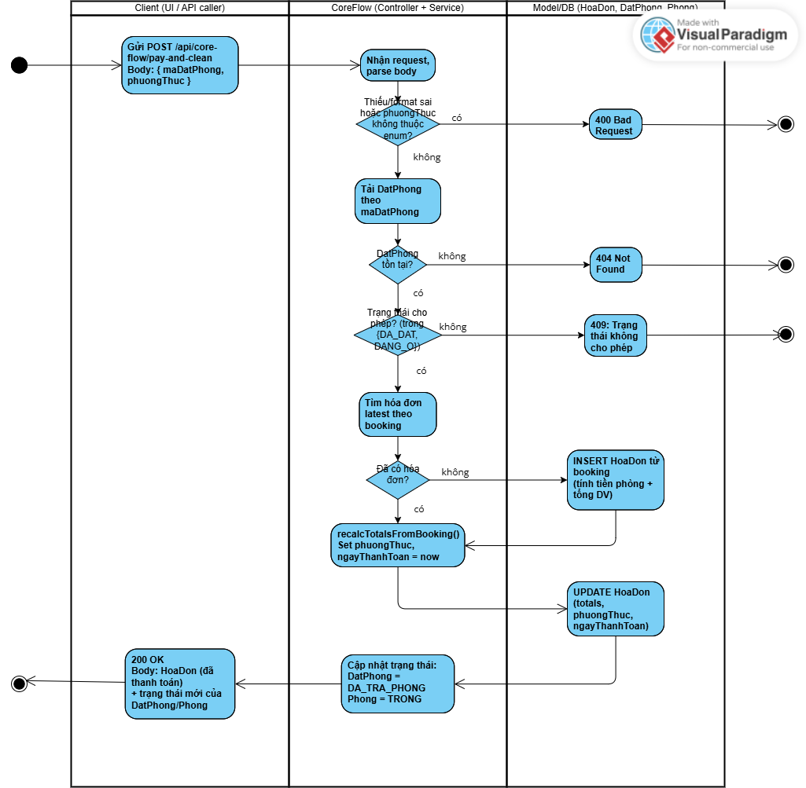


**Công nghệ chính**
- ☕ Java 17, 🍃 Spring Boot 3.x, 🧰 Maven
- 🌐 Spring Web, ✅ Validation, 🔌 JDBC (MySQL Connector/J)
- 🧩 Thymeleaf, 🎨 Bootstrap, 📈 Chart.js
- 🧪 JUnit 5, Spring Test, Mockito

---

## ⚙️ Yêu cầu hệ thống
- ☕ **JDK 17** 
- 🧰 **Maven** 
- 🟦 **MySQL 8.x** (cục bộ hoặc cloud (aiven)).

---

## 🚀 Chạy ứng dụng (Quick Start)

### ▶️ Build & Run
```bash
# Mở codespace đợi tự động cài JDK 17 (vì maven yêu cầu) (mất khoảng 1 đến 2 phút)-> sau đó cài Extension pack for java 

#ấn nút play để chạy

# hoặc

# Mở đúng thư mục module
cd HotelManagementSystem/complete

# Chạy dev (hot reload classpath)
mvn spring-boot:run
```

### 🌐 Truy cập
- UI Dashboard (Thymeleaf): `http://localhost:8080/`
- REST API: `http://localhost:8080/api/...`

> Nếu dùng Codespaces/Container, nhớ **mở cổng 8080** và publish port để nhận public URL.

---

## 🧩 Chức năng chính
- **Khách hàng**: tạo/sửa/xóa/xem, tìm kiếm.
- **Phòng**: CRUD, tìm phòng trống theo ngày và loại phòng.
- **Đặt phòng**: tạo/sửa/xóa/xem; **hủy**, **check-in**, **check-out**.
- **Chi tiết dịch vụ**: gán dịch vụ vào đơn đặt, cập nhật số lượng/đơn giá, xóa, tính tổng dịch vụ.
- **Hóa đơn**: tạo hóa đơn từ đặt phòng, cập nhật (recalc), lấy hóa đơn mới nhất theo mã đặt phòng.
- **Báo cáo**: doanh thu theo tháng; công suất phòng (room nights/by type); dịch vụ bán chạy.
- **Dashboard UI**: hiển thị số liệu/báo cáo dạng biểu đồ.

---

## 🖥️ Giao diện
- **Navbar** cố định phía trên.
- Layout trang chính gồm : 1 khối trung tâm lớn và các ô phía dưới nhỏ hơn; mỗi ô có nút hành động nhỏ (shortcuts).
- Sử dụng **Bootstrap** cho bố cục & components, **Chart.js** cho biểu đồ.
- File tham chiếu: `src/main/resources/templates/coreflow.html` (map từ route `/`).
### Ảnh giao diện
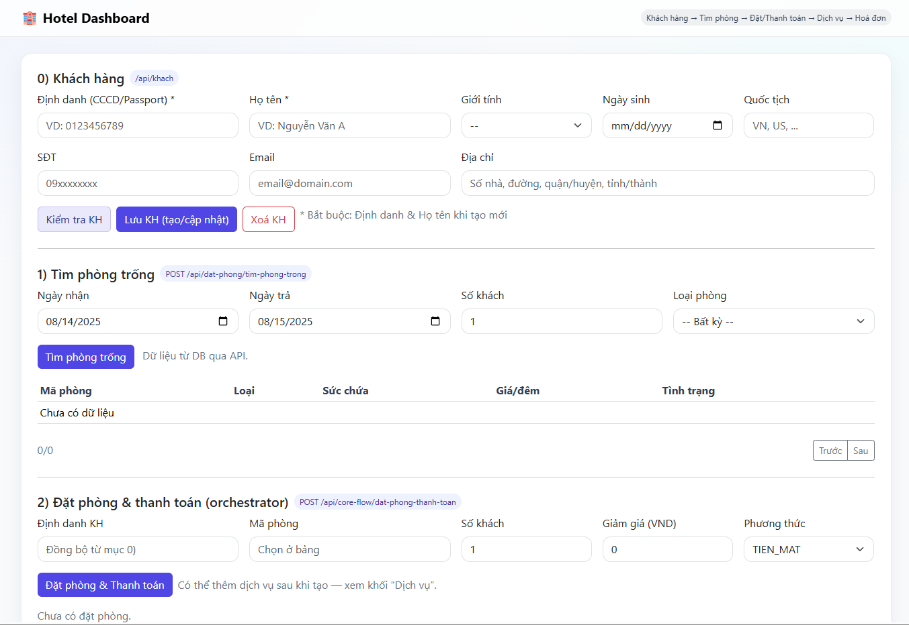
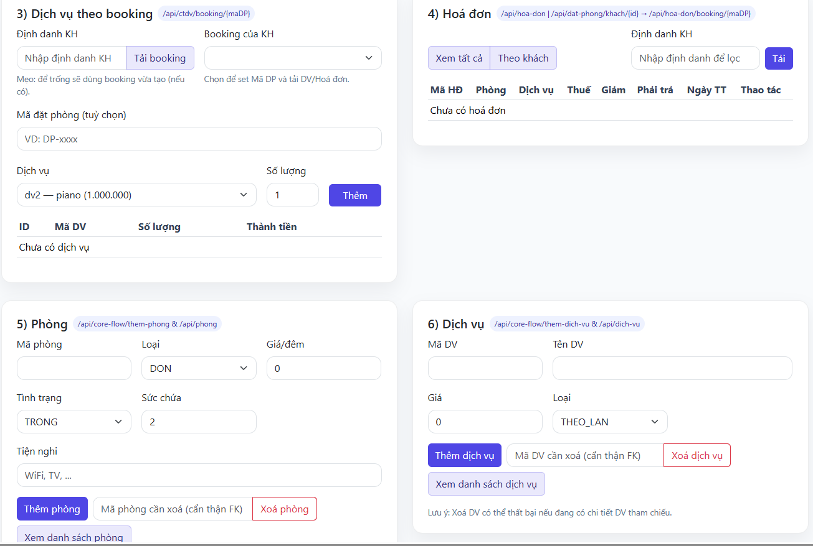
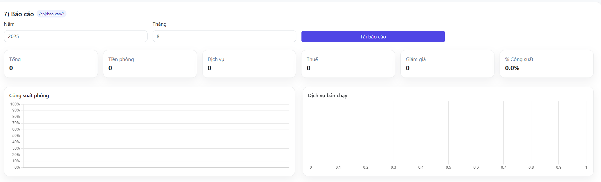
---

## 🗂️ REST API (tóm tắt các đầu mút chính)

### 👤 Khách hàng (`/api/khach`)
- `GET /api/khach` – danh sách
- `GET /api/khach/{id}` – chi tiết
- `POST /api/khach` – tạo
- `PUT /api/khach/{id}` – cập nhật
- `DELETE /api/khach/{id}` – xóa
- `GET /api/khach/search?q=...` – tìm kiếm

### 🛏️ Phòng (`/api/phong`)
- CRUD tương tự
- `GET /api/phong/tim-trong?from=YYYY-MM-DD&to=YYYY-MM-DD&roomType=...` – tìm phòng trống

### 🧾 Đặt phòng (`/api/dat-phong`)
- CRUD và tra cứu
- `POST /api/dat-phong/{maDP}/huy` – hủy
- `POST /api/dat-phong/{maDP}/checkin` – nhận phòng
- `POST /api/dat-phong/{maDP}/checkout` – trả phòng

### 🧺 Chi tiết dịch vụ (`/api/ctdv`)
- `GET /api/ctdv/by-dp/{maDP}` – danh sách dịch vụ theo đơn đặt
- `POST /api/ctdv/add` – thêm dịch vụ vào đơn
- `PUT /api/ctdv/{id}` – cập nhật dòng dịch vụ
- `DELETE /api/ctdv/{id}` – xóa dòng dịch vụ
- `DELETE /api/ctdv/by-dp/{maDP}` – xóa tất cả dịch vụ của đơn
- `GET /api/ctdv/total/{maDP}` – tổng tiền dịch vụ

### 💳 Hóa đơn (`/api/hoa-don`)
- `GET /api/hoa-don` – danh sách
- `GET /api/hoa-don/{id}` – chi tiết
- `GET /api/hoa-don/latest-by-dp/{maDP}` – hóa đơn mới nhất theo đơn đặt
- `POST /api/hoa-don/create-from-booking` – tạo từ đơn đặt (kèm phương thức thanh toán)
- `PUT /api/hoa-don/{id}` – cập nhật & tính lại
- `POST /api/hoa-don/{id}/recalc` – tính lại
- `DELETE /api/hoa-don/{id}` – xóa

### 📊 Báo cáo (`/api/bao-cao`)
- `GET /api/bao-cao/doanh-thu?year=YYYY&month=M` – doanh thu theo tháng
- `GET /api/bao-cao/cong-suat-phong?year=YYYY&month=M` – công suất phòng
- `GET /api/bao-cao/dich-vu-ban-chay?from=YYYY-MM-DD&to=YYYY-MM-DD` – top dịch vụ

---

## 🧪 Kiểm thử
```bash
#chạy
cd HotelManagementSystem/complete
mvn test
#kết quả
```
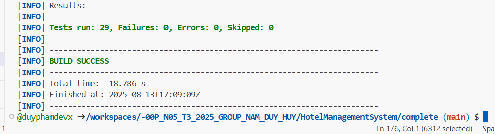
Mã nguồn liên quan: `src/main/java/.../config/GlobalExceptionHandler.java` + `cách file test trong src/test`

## 📑Bảng tiêu chí

| Tiêu chí                         | Trạng thái | Minh chứng                               |
| -------------------------------- | ---------- | ---------------------------------------- |
| MVC + Test                       | ✓          | Cấu trúc + `@WebMvcTest` + ảnh test pass |
| UML Class + ≥5 Activity          | ✓          | Mục “📐 UML & Activity Diagrams”         |
| CRUD ≥3 đối tượng                | ✓          | Khách/Phòng/Đặt phòng/DV/Hóa đơn         |
| Quy trình cốt lõi                | ✓          | Activity + REST ví dụ/curl               |
| Giao diện                        | ✓          | Mục "🖥️ Giao diện"                     |
| Kết nối MySQL (cloud/local)      | ✓          |  Mã nguồn liên quan: `src/main/java/.../database/aivenConnection.java` + `src/main/resources/application.properties`          |


