# 🏪 Ứng Dụng Quản Lý Cửa Hàng Tạp Hóa

> **Dự án cuối kỳ môn Lập trình Hướng Đối Tượng (OOP)**  
> Nhóm 12 – N02_T3_2_2025 – Học kỳ 2 – Năm học 2024-2025


## 📌 Giới thiệu
Ứng dụng quản lý cửa hàng tạp hóa là một hệ thống mô phỏng các nghiệp vụ quản lý nhập hàng, bán hàng, tồn kho, doanh thu và lãi/lỗ. Ứng dụng được xây dựng bằng Java với giao diện console, áp dụng mô hình hướng đối tượng (OOP), lưu trữ dữ liệu bằng file nhị phân và sử dụng các cấu trúc dữ liệu như ArrayList để quản lý thông tin hàng hóa, phiếu nhập, phiếu bán và thống kê doanh thu.

---

## 👥 Thành viên nhóm

| STT | Họ tên           | Mã sinh viên | GitHub                                      | Vai trò                |
|-----|------------------|--------------|----------------------------------------------|------------------------|
| 1   | Vũ Đức Vượng     | 24100383     | [Vu-Duc-Vuong](https://github.com/Vu-Duc-Vuong)   | Team Leader |
| 2   | Tưởng Văn Tuyên  | 24100462     | [vantuyendev](https://github.com/vantuyendev)     | Developer |
| 3   | Nguyễn Lệ Thu	    |     |                                              | Giảng viên hướng dẫn   |

---
## 🧠 Phân tích đối tượng & Chức năng chính

### 1. 📦 Hàng Hóa (`HangHoa`)
- Quản lý thông tin hàng hóa: mã, tên, số lượng, nhà sản xuất, đơn giá
- Thêm, sửa, xóa hàng hóa

### 2. 📥 Nhập Hàng (`Nhap`)
- Lưu phiếu nhập: mã phiếu, mã hàng, số lượng, ngày nhập
- Cập nhật tồn kho khi nhập

### 3. 🛒 Bán Hàng (`Ban`)
- Lưu phiếu bán: mã phiếu, mã hàng, số lượng, ngày bán
- Cập nhật tồn kho khi bán

### 4. 💰 Doanh Thu (`DoanhThu`)
- Tính tổng tiền nhập, bán, doanh thu, lãi/lỗ theo ngày

---

---

## 🗂️ Cấu trúc thư mục

```plaintext
Project/
├── QuanLy/                 # Các class nghiệp vụ quản lý (QuanLyBan, QuanLyNhap, ...)
├── review/                 # File kiểm thử, review logic nghiệp vụ
├── unitest/                # Các file kiểm thử đơn vị
├── gs-serving-web-content-main/initial/ # Spring Boot MVC, controller, model, view
│   ├── src/main/java/com/example/servingwebcontent/
│   │   ├── controller/     # Controller Spring Boot
│   │   ├── model/          # Entity/model JPA
│   │   └── ...
│   └── ...
├── README.md               # Tài liệu mô tả dự án
└── ...
```

---

## 🧪 Kiểm thử & Review

| Lớp (Class)         | Chức năng kiểm thử chính |
|---------------------|--------------------------|
| `HangHoa`           | Thêm, sửa, xóa, hiển thị, cập nhật số lượng, kiểm tra lỗi số lượng không hợp lệ |
| `Nhap`              | Tạo phiếu nhập, cập nhật tồn kho, kiểm tra nhập hàng với dữ liệu không hợp lệ |
| `Ban`               | Tạo phiếu bán, cập nhật tồn kho, kiểm tra bán hàng vượt tồn kho |
| `DoanhThu`          | Tính tổng tiền nhập, bán, doanh thu, lãi/lỗ theo ngày |
| `QuanLyHangHoa`     | Quản lý danh sách hàng hóa, tìm kiếm, thống kê tồn kho |
| `QuanLyNhap`        | Quản lý phiếu nhập, thống kê nhập theo ngày |
| `QuanLyBan`         | Quản lý phiếu bán, thống kê bán theo ngày |

**Thư mục kiểm thử:**
- `review/`: kiểm thử logic nhập, bán, tồn kho, doanh thu
- `unitest/`: kiểm thử đơn vị các class nghiệp vụ

---


## 🛠️ Chức năng chính

### 1. Quản lý Doanh thu
-Hiển thị tổng tiền nhập / tổng tiền bán, doanh thu theo thời gian
### 2. Quản lý hàng hóa
- Sửa / Xóa hàng hóa
- Gán sản phẩm cho nhà sản xuất
- Cập nhật số lượng sản phẩm sau mỗi đơn hàng

### 3. Quản lý nhập hàng
- Tạo / Cập nhật phiếu nhập hàng
- Hiển thị danh sách phiếu nhập hàng
- Tính tổng tiền đơn hàng
- Sửa/Xóa phiếu nhập
### 4. Quản lý bán hàng
- Tạo và cập nhật phiếu bán hàng
-Sửa/Xóa phiếu bán hàng
- Tính tổng tiền bán hàng
-Hiển thị danh sách phiếu nhập hàng
### 5. Lưu trữ dữ liệu
- Dữ liệu được lưu vào file nhị phân
- Sử dụng ObjectOutputStream, ObjectInputStream
- Áp dụng ArrayList, Map,... để quản lý dữ liệu trong bộ nhớ

## 📊 Biểu đồ lớp (Class Diagram)

### 🏗️ Class Diagram

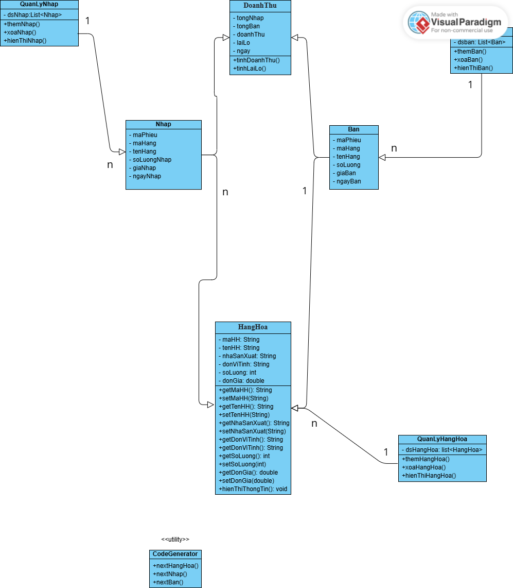
---

## 🔁 Biểu đồ hoạt động (Activity Diagram)

### 1. Đăng nhập
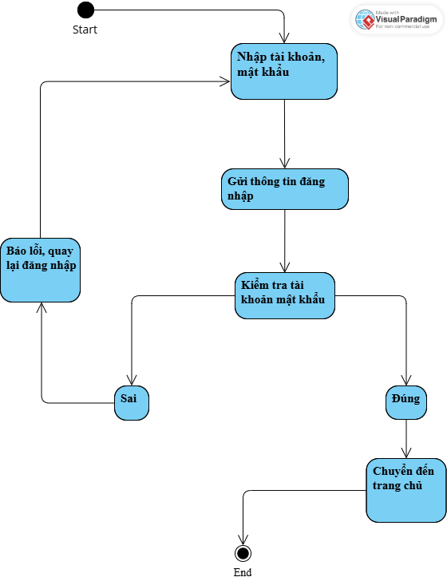


### 2. Quản lý hàng hóa 
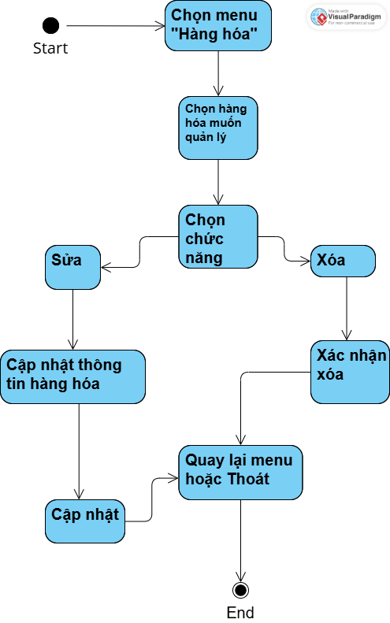


### 3. Nhập hàng
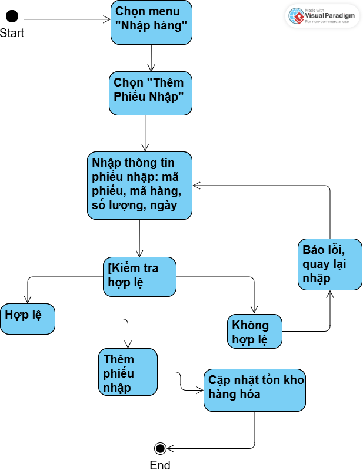

### 4. Bán hàng
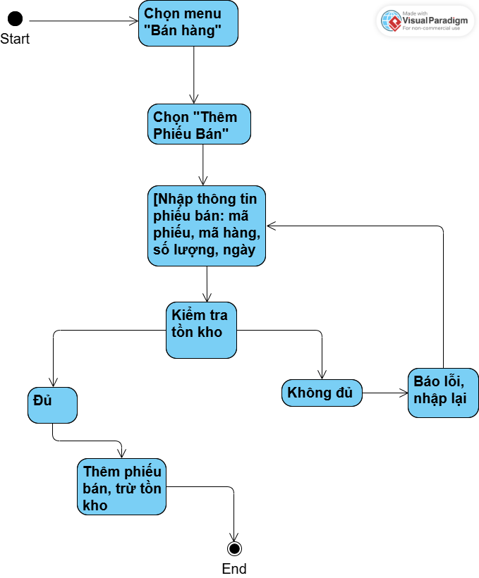

### 5. Doanh thu 
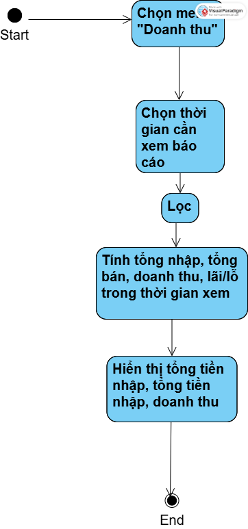

---

## 🖼️ Giao diện chương trình
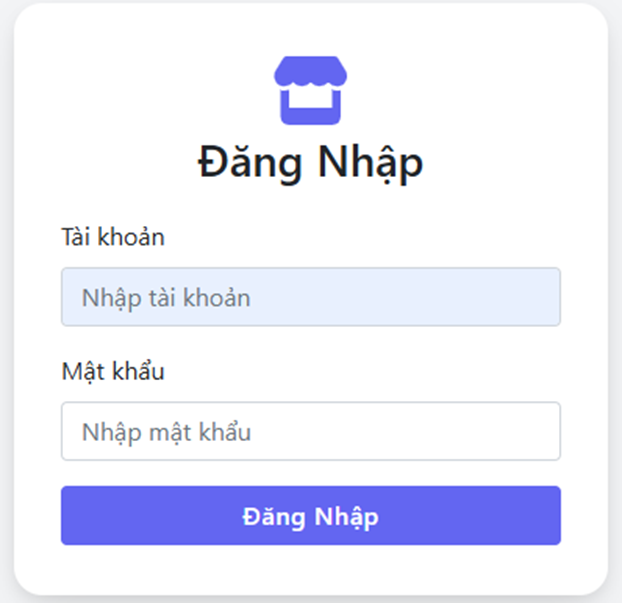

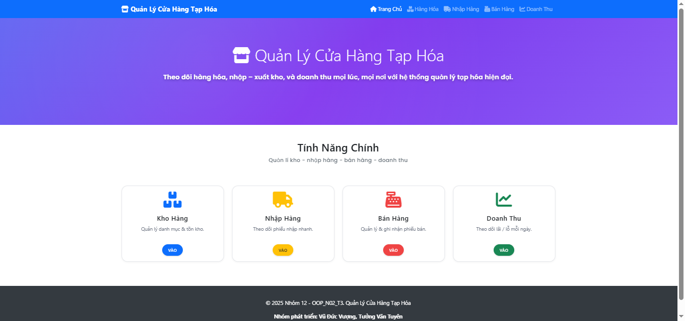

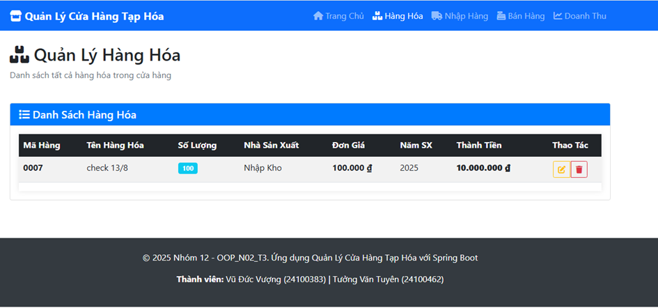

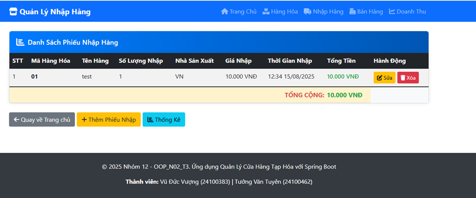

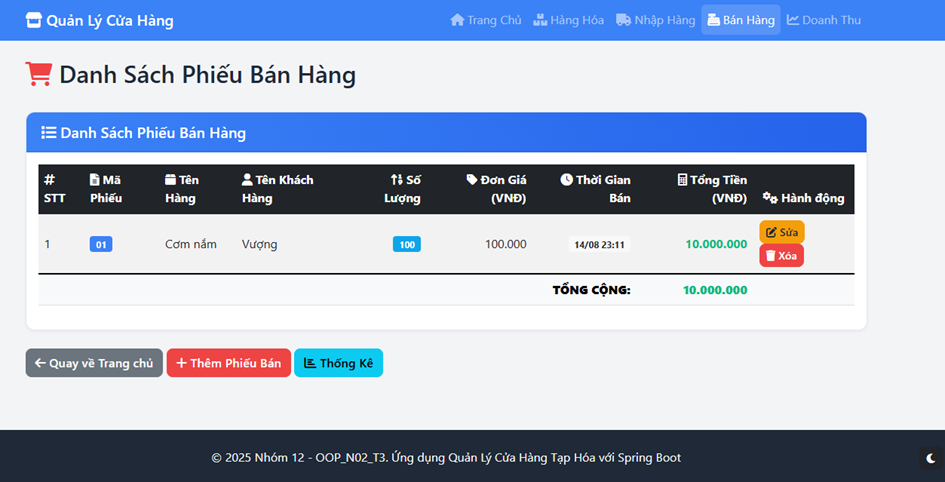

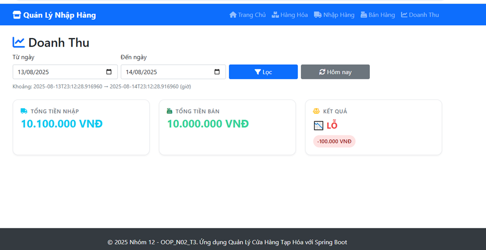

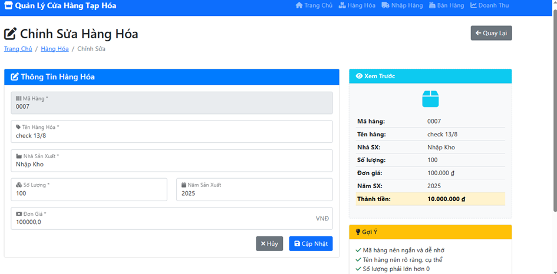

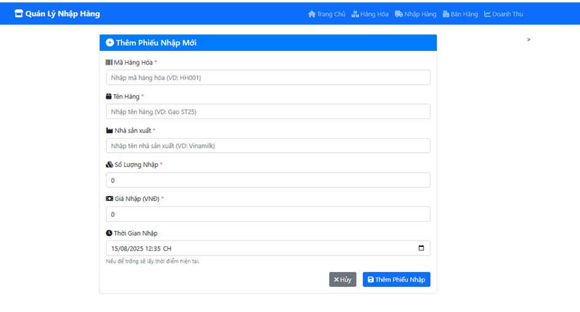

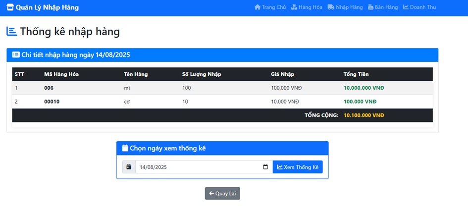

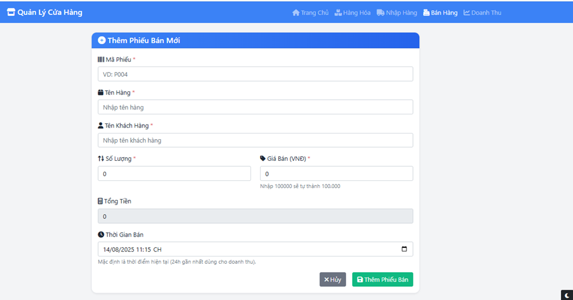

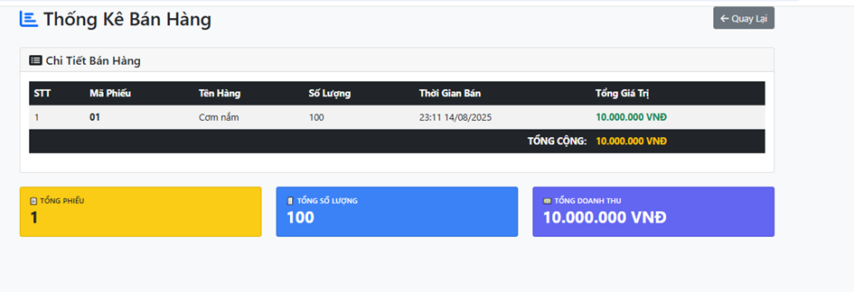

## 🔑 Thông tin đăng nhập
- tài khoản : admin
- mật khẩu : admin
## 🚀 Hướng dẫn chạy

### 1. Chạy ứng dụng Spring Boot:
```
Trong Terminal tích hợp, chạy:

cd Project/gs-serving-web-content-main/initial && ./mvnw spring-boot:run

Nhấn nút "Ports" → chọn 9999 → publish port để nhận public URL.
(nếu web lag vui lòng tắt và bật lại port)
```

### 2. Chạy kiểm thử nghiệp vụ (Java thuần):
```bash
cd Project/review
javac *.java
java TestNhapHang
java TestBanHang
java TestTonKho
java TestDoanhThu
```

---

## 💡 Công nghệ sử dụng
- Ngôn ngữ lập trình: **Java**
- Mô hình hướng đối tượng (OOP)
- **Framework**: [Spring Boot](https://spring.io/projects/spring-boot)
  - Quản lý luồng xử lý, cấu trúc theo mô hình MVC
- Giao diện: Console (text-based)
- Lưu trữ: File nhị phân 
- Cấu trúc dữ liệu: ArrayList, LinkedList, Map, ....
---

## 📚 Tài liệu tham khảo

- Slide bài giảng môn Lập trình Hướng Đối Tượng – GVHD: Nguyễn Lệ Thu
- Java Docs – Oracle
- Stack Overflow – Community

---
> © 2025 Nhóm 12 – Ứng dụng quản lý cửa hàng tạp hóa – Mã nguồn mở cho mục đích học tập
